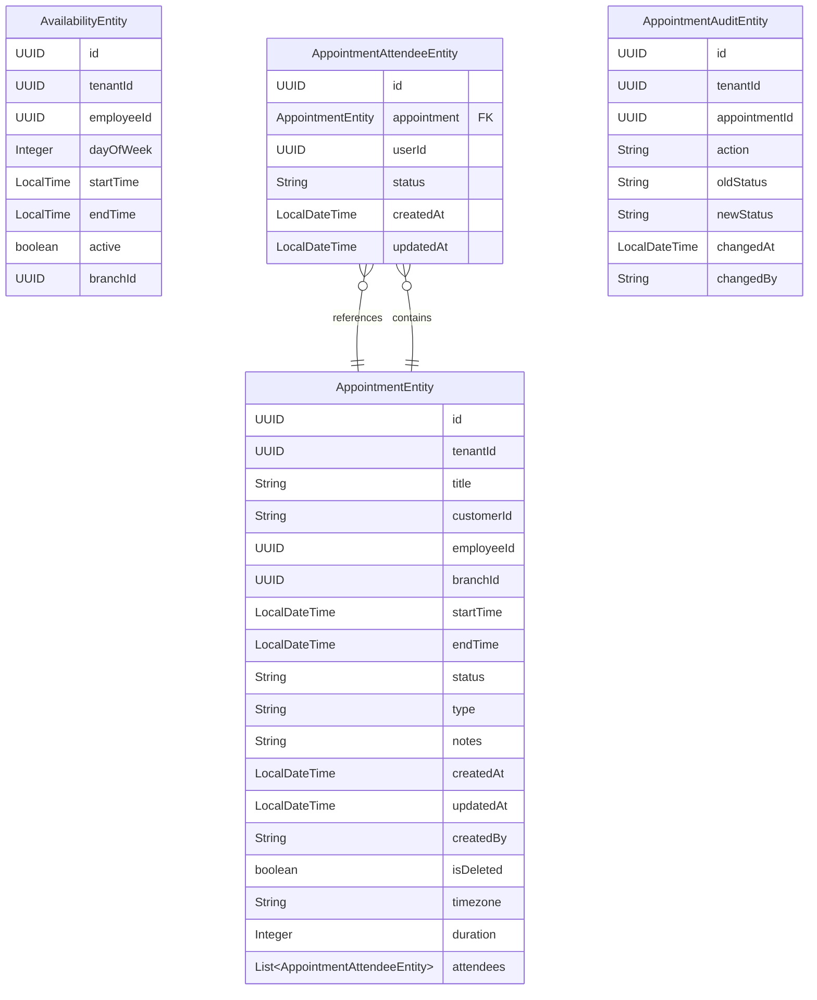
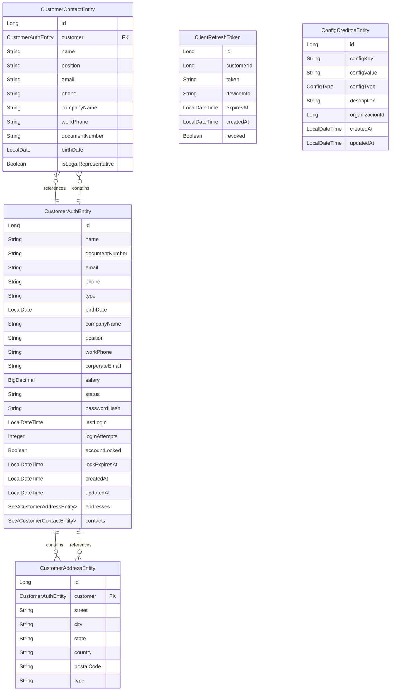
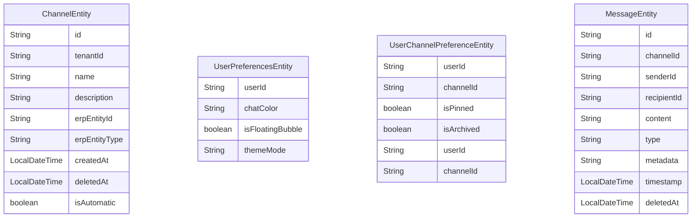
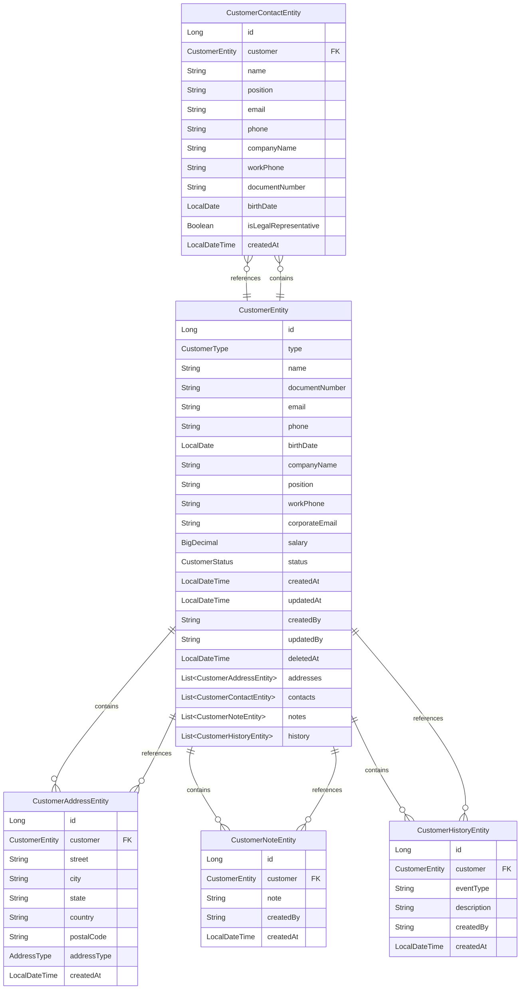
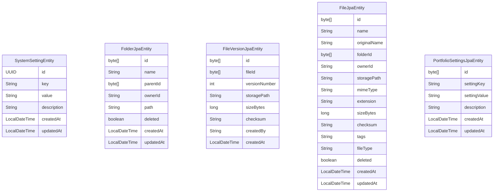
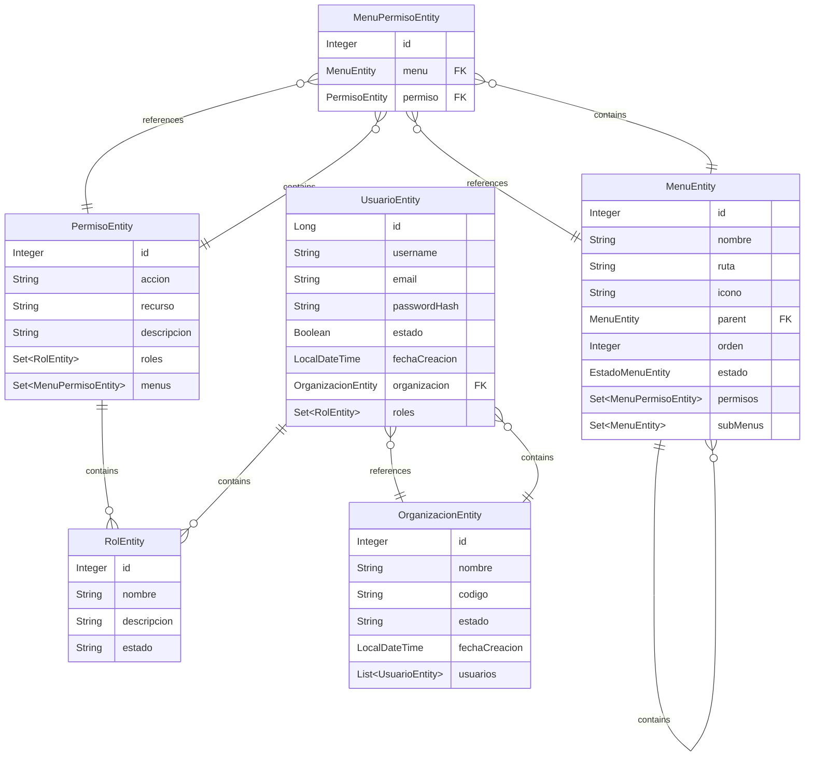
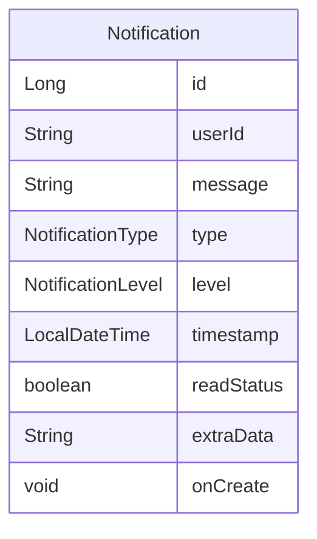
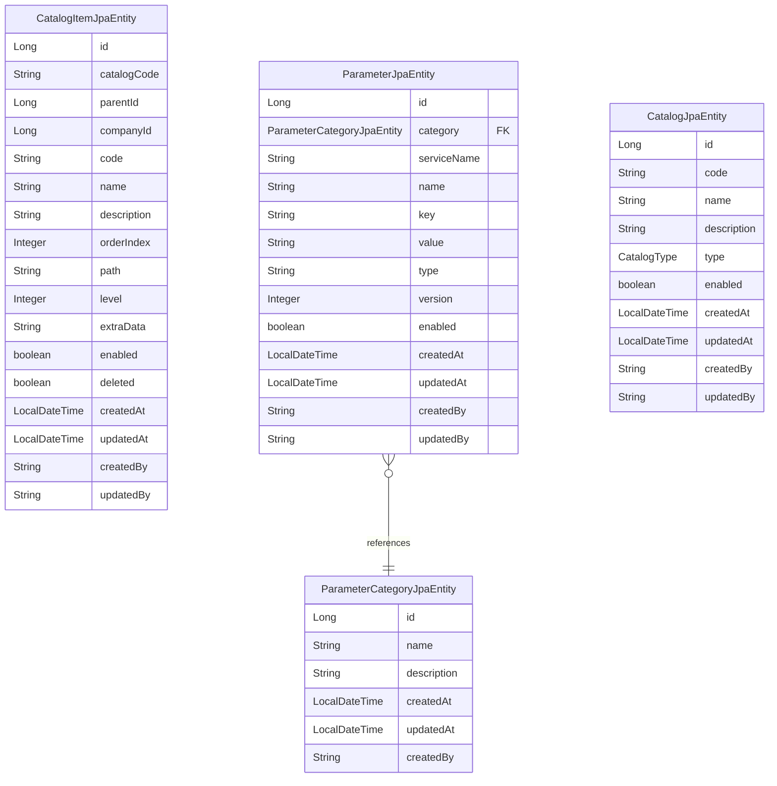
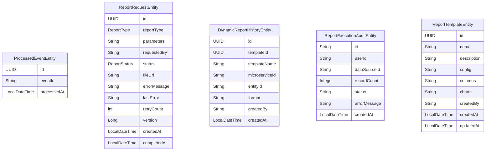

# ER Diagrams for Microservices

## appointment-service

## client-auth-service

## conversational-hub

## customer-service

## erp-portfolio-service

## iam-core

## iam-core-p/iam-core

```mermaid
erDiagram
    Menu {
        Long id
        String nombre
        String ruta
        String icono
        String codigo
        Menu parent FK
        Set~Menu~ children
        Integer orden
        Boolean estado
        Set~RoleMenuPermission~ menuPermissions
    }
    Menu }o--|| Menu : "references"
    Menu ||--o{ Menu : "contains"
    Menu ||--o{ RoleMenuPermission : "contains"
    RoleMenuPermission {
        Long id
        Role role FK
        Menu menu FK
        Boolean canRead
        Boolean canCreate
        Boolean canUpdate
        Boolean canDelete
    }
    RoleMenuPermission }o--|| Role : "references"
    RoleMenuPermission }o--|| Menu : "references"
    Role {
        Integer roleId
        String authority
        Set~RoleMenuPermission~ menuPermissions
    }
    Role ||--o{ RoleMenuPermission : "contains"
    ApplicationUser {
        Integer userId
        String username
        String password
        String email
        Boolean estado
        LocalDateTime fechaCreacion
        Long organizacionId
        String firstName
        String lastName
        String phone
        String bio
        String profilePicture
        String facebook
        String twitter
        String linkedin
        String instagram
        String country
        String city
        String postalCode
        String taxId
        Set~Role~ authorities FK
        Set~GrantedAuthority~ permissions
    }
    ApplicationUser ||--o{ Role : "contains"
    BlacklistedToken {
        Long id
        String token
    }
    UserSession {
        Long id
        Integer userId
        String username
        LocalDateTime startTime
        LocalDateTime endTime
        LocalDateTime expiresAt
        String tokenHash
        String ipAddress
        String deviceInfo
        SessionStatus status
        String closedBy
        String closedReason
        String city
        String country
        Double latitude
        Double longitude
        Boolean isVpn
        Boolean isProxy
        String isp
    }
    AppDesignSettings {
        Long id
        ApplicationUser user FK
        String appName
        String appFont
        String logoUrl
        String faviconUrl
        String primaryColor
        String secondaryColor
        String accentColor
        Boolean isDarkMode
        String sidebarColor
        String tableHeaderColor
        String headerColor
        String infoColor
        String warningColor
        String errorColor
        String successColor
        String systemColor
    }
    AppDesignSettings }o--|| ApplicationUser : "references"
    Project {
        Long projectID
        String project_Name
        String company_Name
        LocalDate start_Date
        LocalDate end_Date
        String rate
        String rate_Type
        String priority
        String total_Hours
        String status
        String created_By
        String description
        String progress
    }
    LeaderProject {
        Long leaderProjectID
        Long projectID
        Long leaderID
        String first_Name
        String last_Name
        String designation
        String imageName
    }
    Item {
        Long itemID
        String name
        String description
        double uniteCost
        Integer quantity
        double amount
        EstimatesInvoices estimateInvoices FK
    }
    Item }o--|| EstimatesInvoices : "references"
    EstimatesInvoices {
        Long id
        String type
        Client client FK
        Project project FK
        LocalDate createDate
        LocalDate estimateDate
        LocalDate expiryDate
        BigDecimal total
        String otherInfo
        String status
        Integer tax
        List~Item~ items
    }
    EstimatesInvoices }o--|| Client : "references"
    EstimatesInvoices }o--|| Project : "references"
    EstimatesInvoices ||--o{ Item : "contains"
    MessageTask {
        Long messageTaskID
        Long taskID
        Long employeeID
        String first_Name
        String last_Name
        String imageName
        String date
        String message
    }
    ImageProject {
        Long imageProjectID
        Long projectID
        String imageName
        String originalName
    }
    Employee {
        Long employeeID
        String first_Name
        String last_Name
        String userName
        String email
        String password
        LocalDate joinDate
        String phone
        Department department FK
        Designation designation FK
        String company
        Integer remainingLeaves
        String role
        Double pinCode
        String cv_Name
        Byte cv
        String cin
        String reportTo
        LocalDate birthday
        String address
        String gender
        String state
        String country
        String imageName
    }
    Employee }o--|| Department : "references"
    Employee }o--|| Designation : "references"
    Holiday {
        Long holidayId
        String holidayName
        LocalDate holidayDate
        LocalDate holidayDateEnd
    }
    Client {
        Long clientID
        String first_Name
        String last_Name
        String gender
        String designation
        String personnel_Email
        String personnel_Phone
        String imageName
        String company_Name
        LocalDate date_Creation
        String address
        String ice
        String rc
        String ville
        String capital
        String rib
        String company_Email
        String company_Phone
        String website
    }
    Leaves {
        Long leavesID
        String username
        String EmployeeName
        LeaveType leaveType FK
        Integer NumberOfDays
        LocalDate StartDate
        LocalDate EndDate
        String LeaveReason
        String ApprovedBy
        String Status
    }
    Leaves }o--|| LeaveType : "references"
    Payment {
        Long id
        EstimatesInvoices estimatesInvoices FK
        LocalDate paidDate
        BigDecimal paidAmount
    }
    Payment }o--|| EstimatesInvoices : "references"
    Expenses {
        Long Id
        String itemName
        String purchaseFrom
        LocalDate purchaseDate
        String purchasedBy
        BigDecimal Amount
        String paidBy
        String Status
        byte[] data
    }
    EmployeeProject {
        Long employeeProjectID
        Project project FK
        Employee employee FK
        String first_Name
        String last_Name
        String designation
        String imageName
    }
    EmployeeProject }o--|| Project : "references"
    EmployeeProject }o--|| Employee : "references"
    Department {
        Long departmentID
        String departmentName
    }
    FileProject {
        Long fileProjectID
        Long projectID
        String fileName
        String originalName
        String dateCreation
    }
    Designation {
        Long designationID
        String designationName
        Department department FK
    }
    Designation }o--|| Department : "references"
    EmployeeTask {
        Long employeeTaskID
        Long taskID
        Long employeeID
        String first_Name
        String last_Name
        String designation
        String imageName
    }
    LeaveType {
        Long leaveTypeId
        String username
        String leaveName
        Integer days
        String leaveStatus
    }
    Task {
        Long taskID
        Project project FK
        String task_Name
        String task_Priority
        LocalDate due_Date
        String description
        String status
    }
    Task }o--|| Project : "references"
```

## notification-service

## parametrizaciones

## reportes-service

